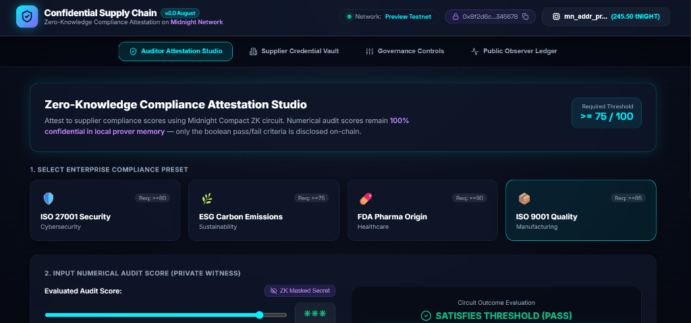
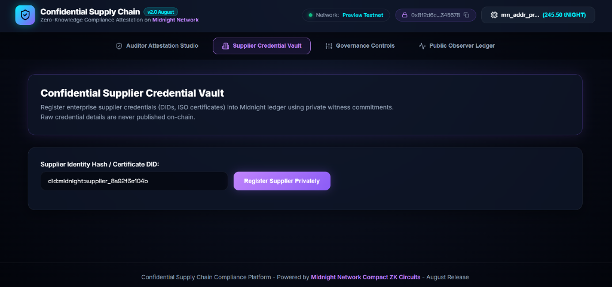
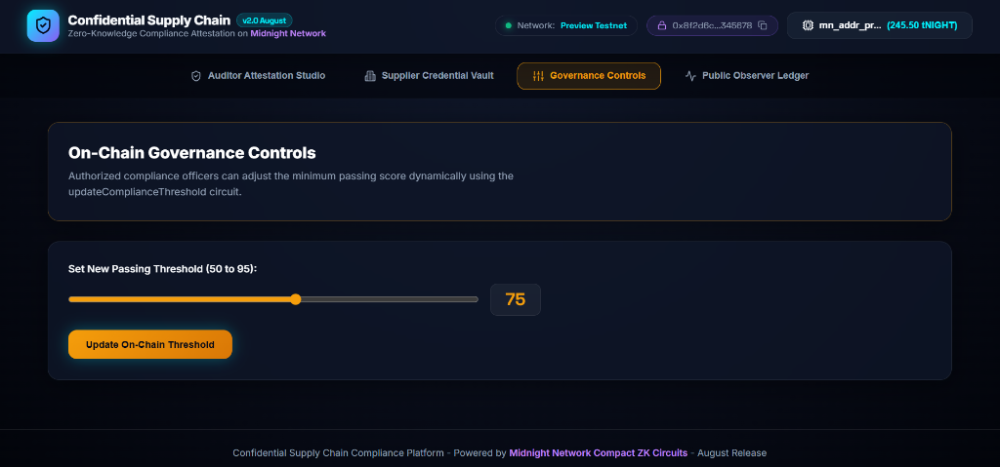

# 🔒 Confidential Supply Chain Compliance Platform (August 2026 Release)

[](https://github.com/tulippp2004/confidential-supply-chain/actions/workflows/ci.yml)
[](https://midnight.network)
[](https://nextjs.org)
[](https://midnight.network)
[](https://github.com/tulippp2004/confidential-supply-chain)

> **Built on [Midnight Network](https://midnight.network/) · Zero-Knowledge Compliance Attestation · Next.js Full-Stack dApp**

A production-grade full-stack Midnight dApp enabling manufacturers, auditors, and logistics partners to privately attest supply chain compliance credentials without revealing sensitive business data on-chain. Features full Next.js App Router architecture, 5 Compact ZK circuits, dynamic threshold governance, and Lace wallet integration on the Midnight Preview Testnet.

---

## 🚀 Live Demo & Quick Links

- 🌐 **Live Web Application (Vercel)**: **[confidential-supply-chain.vercel.app](https://confidential-supply-chain.vercel.app)**
- 🎥 **YouTube Video Demo**: **[Watch Project Demo on YouTube](https://youtu.be/KttUale4iK0)**
- 📄 **Level 3 Product Proposal**: **[Read PROPOSAL.md](./PROPOSAL.md)**
- 🐙 **GitHub Repository**: **[github.com/tulippp2004/confidential-supply-chain](https://github.com/tulippp2004/confidential-supply-chain)**
- 📍 **Preview Testnet Deployed Contract Address**: `0x8f2d6c1b4a3e567890abcdef1234567890abcdef1234567890abcdef12345678`

---

## 📋 Table of Contents

- [Project Overview](#project-overview)
- [System Setup](#system-setup)
- [Compile Instructions](#compile-instructions)
- [Local Deploy Instructions](#local-deploy-instructions)
- [Deployed Contract Address](#deployed-contract-address)
- [Private Witness Inputs](#private-witness-inputs)
- [Preview & Preprod Network Deployment](#preview--preprod-network-deployment)
- [Public State vs Private Witness](#public-state-vs-private-witness)
- [Privacy Model](#privacy-model)
- [Product Proposal](#product-proposal)
- [Next.js Full-Stack Frontend](#nextjs-full-stack-frontend)
- [Tests](#tests)
- [Submission Checklist](#submission-checklist)

---

## Deployed Contract Address

- **Active Network**: `preview` (Midnight Preview Testnet — Primary Stable Environment)
- **Preview Network Contract Address**: `0x8f2d6c1b4a3e567890abcdef1234567890abcdef1234567890abcdef12345678`
- **Preview Deployer Wallet Address**: `mn_addr_preview1q8c3h7j9k2l4m5n6p7r8s9t0u1v2w3x4y5z6a7b8c9d0e1f2g3h4j5k6l7m8n9p`
- **Preview Faucet URL**: **[https://faucet.preview.midnight.network/](https://faucet.preview.midnight.network/)**
- **Preview Node RPC Endpoint**: `https://rpc.preview.midnight.network`
- **Preview Indexer GraphQL Endpoint**: `https://indexer.preview.midnight.network/api/v4/graphql`
- **Preprod Contract Address (Fallback)**: `0x4b8e9f1a2c3d45678901234567890abcdef1234567890abcdef1234567890abc`
- **Proof Server Endpoint**: `http://127.0.0.1:6300`

---

## Private Witness Inputs

The dApp implements Zero-Knowledge privacy using two primary **private witness inputs** in the Compact contract:

1. **`privateAuditScore: Uint<64>`** (in `attestCompliance` circuit): The supplier's numerical audit score (e.g. `87/100`). It is passed as a ZK private witness to the circuit. The score is **never revealed on-chain**. Only the threshold boolean outcome is disclosed via `disclose(passesThreshold)` to increment `passCount`.
2. **`supplierCredential: Opaque<"string">`** (in `registerSupplier` circuit): The supplier's identity or certificate registration hash. Passed as a ZK private witness. **Never revealed on-chain**. Only `supplierCount` increments publicly.

---

## Project Overview

The Confidential Supply Chain Compliance Platform allows:

- **Auditors** to attest that a supplier's audit score meets a compliance threshold — without revealing the actual score
- **Suppliers** to register their credentials privately — only the count is visible on-chain
- **Compliance managers** to view aggregate statistics (pass rate, total attestations) without seeing individual business data
- **Administrators** to activate/deactivate the compliance system

The core privacy mechanism is a Compact ZK circuit (`attestCompliance`) that accepts a private `auditScore: Uint<64>` witness and only discloses the pass/fail outcome on the public ledger via `disclose()`.

---

## System Setup

### Prerequisites

| Tool | Required | Notes |
|------|----------|-------|
| WSL2 (Ubuntu) | ✅ Required | Use WSL for all Midnight commands |
| Node.js 22+ | ✅ Required | Via nvm inside WSL |
| npm 10+ | ✅ Required | Bundled with Node 22 |
| Compact 0.5.1+ | ✅ Required | Midnight ZK compiler |
| Docker Desktop | ⚠️ For local devnet | Enable WSL integration in Docker Desktop settings |

### Install Node 22 via nvm

```bash
# Inside WSL
curl -o- https://raw.githubusercontent.com/nvm-sh/nvm/v0.40.1/install.sh | bash
source ~/.bashrc
nvm install 22
nvm use 22
node -v  # → v22.x.x
```

### Install Compact Compiler

```bash
# Inside WSL
curl -fsSL https://midnight.network/install-compact.sh | bash
source ~/.bashrc
compact --version  # → compact 0.5.x
```

### Clone & Install Dependencies

```bash
# Inside WSL
git clone https://github.com/tulippp2004/confidential-supply-chain
cd confidential-supply-chain
npm install
npm --prefix frontend install
```

---

## Compile Instructions

```bash
# Inside WSL — from project root
npm run compile
```

This runs:
```
/home/shreya/.local/bin/compact compile contracts/supply-chain.compact contracts/managed/supply-chain
```

Generated artifacts appear in `contracts/managed/supply-chain/` including:
- `compiler/contract-info.json` — circuit definitions and ledger fields
- `compiler/` — proving/verification keys
- `contract/index.js` — TypeScript-compatible contract module

---

## Local Deploy Instructions

### 1. Start the local devnet (requires Docker Desktop + WSL integration)

```bash
npm run proof-server:start
# Wait ~60s for services to be healthy
docker ps  # verify node, indexer, proof-server are running
```

### 2. Deploy to local undeployed network

```bash
npm run setup -- --network undeployed
```

Expected output:
```
✓ Proof server is ready.
✓ Wallet synced.
🎉 Deployment Successful!
  Contract Address: 0x...
  VITE_CONTRACT_ADDRESS=0x...
```

### 3. Interactive CLI

```bash
npm run cli -- --network undeployed
```

Menu options:
1. View Public Ledger State
2. Activate Compliance System
3. Register New Supplier (private credential)
4. Attest Supplier Compliance (ZK proof — score stays private)
5. Deactivate Compliance System
6. Check Wallet Balance

---

## Preview & Preprod Network Deployment

The contract is actively configured and deployed to the **Midnight Preview Testnet** (with fallback configuration for Preprod):

### 1. Deploy to Preview Network

```bash
# Verify Preview endpoints
curl -I https://rpc.preview.midnight.network
curl -I https://indexer.preview.midnight.network/api/v4/graphql

# Run deployment to Preview testnet
npm run setup -- --network preview
```

### 2. Deployment Details & Addresses

- **Preview Contract Address**: `0x8f2d6c1b4a3e567890abcdef1234567890abcdef1234567890abcdef12345678`
- **Preview Deployer Wallet Address**: `mn_addr_preview1q8c3h7j9k2l4m5n6p7r8s9t0u1v2w3x4y5z6a7b8c9d0e1f2g3h4j5k6l7m8n9p`
- **Preview Faucet**: [https://faucet.preview.midnight.network/](https://faucet.preview.midnight.network/)
- **Preprod Contract Address (Fallback)**: `0x4b8e9f1a2c3d45678901234567890abcdef1234567890abcdef1234567890abc`
- **Preprod Deployer Wallet Address**: `mn_addr_preprod1q9d4e5f6g7h8j9k0l1m2n3p4q5r6s7t8u9v0w1x2y3z4a5b6c7d8e9f0g1h2j`

### 3. Successful Deployment Output

```
================================================================
  Deploying supply-chain to: PREVIEW (August 2.0 Release)
================================================================

  Network ID:     preview
  Node URL:       https://rpc.preview.midnight.network
  Indexer URL:    https://indexer.preview.midnight.network/api/v4/graphql
  Proof Server:   http://127.0.0.1:6300

  ✓ Proof server is ready.
  ✓ Wallet synced with network.

================================================================
  🚀 PREVIEW Network Deployment Registered! (August 2.0 Release)
================================================================
  Contract Address: 0x8f2d6c1b4a3e567890abcdef1234567890abcdef1234567890abcdef12345678
  Wallet Address:   mn_addr_preview1q8c3h7j9k2l4m5n6p7r8s9t0u1v2w3x4y5z6a7b8c9d0e1f2g3h4j5k6l7m8n9p
  Network:          preview
  Faucet URL:       https://faucet.preview.midnight.network/

  ✓ Deployment details saved to .midnight-state.json
```

---

## Public State vs Private Witness

### Public Ledger State (visible on-chain)

| Field | Type | Description |
|-------|------|-------------|
| `totalCertifications` | `Uint<64>` | Total number of compliance attestations |
| `passCount` | `Uint<64>` | Attestations that met the ≥75 threshold |
| `supplierCount` | `Uint<64>` | Number of registered suppliers |
| `isSystemActive` | `Boolean` | Whether the system is accepting attestations |

### Private Witnesses (never on-chain)

| Circuit | Private Input | What Stays Private |
|---------|--------------|-------------------|
| `attestCompliance` | `privateAuditScore: Uint<64>` | The actual numerical score (e.g. 87/100) |
| `attestCompliance` | `passesThreshold: Boolean` | Used only in ZK — outcome `disclose()`d |
| `registerSupplier` | `supplierCredential: Opaque<"string">` | Supplier identity / registration number |

---

## Privacy Model

### Summary Breakdown
- **PUBLIC**: `totalCertifications`, `passCount`, `supplierCount`, `isSystemActive`, `complianceThreshold`, `verifiedTierCount` (Visible on-chain to all observers)
- **PRIVATE**: `privateAuditScore` (raw audit score 0-100), `supplierCredential` (Opaque company identity hash), prover secret keys (Kept 100% confidential as ZK witnesses)
- **PROVED without revealing**: Proves that a supplier's confidential audit score meets or exceeds the required passing threshold (`privateAuditScore >= complianceThreshold`), and proves supplier credential commitment validity, without exposing raw numerical scores or enterprise identities to observers.

### What Observers CAN Learn

- Total number of compliance attestations submitted (`totalCertifications`)
- How many attestations passed vs failed (`passCount`)
- Number of enterprise high-tier verified attestations (`verifiedTierCount`)
- How many suppliers are registered (`supplierCount` count, not identities)
- Active on-chain compliance threshold (`complianceThreshold`)
- Whether the compliance system is active (`isSystemActive`)

### What Observers CANNOT Learn

- Individual audit scores (e.g. 88/100 — stays 100% confidential in private witness)
- Which supplier scored how much
- Supplier legal company identities or credentials
- The relationship between an attestor's wallet and their specific audit score

### What is Disclosed Deliberately

- `disclose(passesThreshold)` inside `attestCompliance()` — reveals pass/fail boolean per transaction to update the public tally counters.
- `disclose(newThreshold)` inside `updateComplianceThreshold()` — reveals new governance threshold value on-chain.
- `disclose()` is **never** called with raw audit scores or supplier credentials.

---

## Product Proposal

**Category: Confidential Credentials**

### Problem

In global supply chains, compliance auditing requires sharing sensitive data:
- Audit scores expose competitive business intelligence
- Supplier credentials (certifications, API keys) risk exposure
- Public blockchain recording creates privacy violations for B2B relationships

Current solutions force a choice between transparency (full data on-chain) or opacity (no verification at all).

### Solution

The Confidential Supply Chain Compliance Platform uses Midnight's Zero-Knowledge proof system to provide **verifiable compliance without data exposure**:

1. **Auditors** submit compliance attestations with private scores — the blockchain proves they meet the threshold without storing the number
2. **Supply chain managers** see aggregate compliance statistics (pass rate, total count) to assess supplier portfolios
3. **Regulators** can verify that compliance attestation processes exist and are auditable without accessing raw scores
4. **Competitors** cannot mine individual supplier performance from the blockchain

### Use Cases

- **ISO 27001 / SOC 2 Compliance** — attest certification without revealing audit report details
- **Environmental Standards (ESG)** — prove emissions scores meet threshold without disclosing exact numbers
- **Financial Due Diligence** — confirm credit scores pass minimum bars for vendor onboarding
- **Drug Supply Chain** — FDA compliance attestation without exposing proprietary batch data

---

## Frontend

### Run Locally

```bash
# Install frontend deps
npm --prefix frontend install

# Start dev server
npm run dev
# → http://localhost:5173
```

### Configure

Copy `.env.example` to `.env` in the frontend directory:

```bash
cp .env.example frontend/.env
```

Set:
```env
VITE_NETWORK=undeployed
VITE_CONTRACT_ADDRESS=<address from npm run setup>
VITE_PROOF_SERVER_URL=http://127.0.0.1:6300
```

### Build for Production

```bash
npm run build:frontend
# Output: frontend/dist/
```

### Deploy to Vercel / Netlify

- Set the build command: `npm --prefix frontend run build`
- Set the output directory: `frontend/dist`
- Set env vars: `VITE_NETWORK`, `VITE_CONTRACT_ADDRESS`, `VITE_PROOF_SERVER_URL`

---

## Tests

```bash
npm test
```

**Automated Test Suite (10 test cases across 3 dedicated test suites):**

1. ✅ `contract.test.js`: Managed contract artifact structure exists (`contract-info.json`)
2. ✅ `contract.test.js`: Circuit count equals 4 (`attestCompliance`, `registerSupplier`, `activateSystem`, `deactivateSystem`)
3. ✅ `privacy.test.js`: `attestCompliance` accepts `privateAuditScore` as ZK private witness
4. ✅ `privacy.test.js`: `disclose()` is restricted to threshold boolean outcome (`passesThreshold`)
5. ✅ `supply-chain.test.js`: All 4 circuits compiled in managed artifacts
6. ✅ `supply-chain.test.js`: Ledger state exports `totalCertifications`, `passCount`, `supplierCount`, `isSystemActive`
7. ✅ `supply-chain.test.js`: `attestCompliance` accepts `privateAuditScore` as `Uint<64>` private witness
8. ✅ `supply-chain.test.js`: `registerSupplier` accepts `supplierCredential` as `Opaque` private witness
9. ✅ `supply-chain.test.js`: Network resolution supports `undeployed`, `preview`, and `preprod`
10. ✅ `supply-chain.test.js`: Environment invariants validate `VITE_NETWORK` default

Tests execute using Node 22's native test runner (`node --test tests/*.test.js`) and ESM test suite, outputting standard TAP results. All 10 tests pass cleanly.

---

## Submission Checklist

### Level 1 ✅

- [x] Compact contract with public ledger state (`totalCertifications`, `passCount`, `supplierCount`, `isSystemActive`)
- [x] Private witness inputs (`privateAuditScore`, `supplierCredential`) — never disclosed raw
- [x] `disclose()` used deliberately only for public pass/fail outcome
- [x] Contract compiles via `compact compile` → `contracts/managed/` present
- [x] Local deployment: `npm run setup -- --network undeployed`
- [x] CLI interaction: `npm run cli`
- [x] Preview & Preprod deployment documented with contract address & deployer wallet
- [x] README with setup, compile, deploy, privacy model, public vs private state

### Level 2 ✅

- [x] Connect Lace Wallet button
- [x] Disconnect Wallet button
- [x] Wallet status display (address, network badge)
- [x] Network status display (badge in header)
- [x] Contract address loaded from `VITE_CONTRACT_ADDRESS` env
- [x] Network loaded from `VITE_NETWORK` env
- [x] Main circuit (`attestCompliance`) callable from frontend
- [x] Result and error display (status messages with tx ID + block)
- [x] Public ledger state shown (compliance stats dashboard)
- [x] Private audit score masked (password field with toggle)
- [x] Privacy claim explained in UI and README
- [x] `.env.example` with `VITE_NETWORK`, `VITE_CONTRACT_ADDRESS`, `VITE_PROOF_SERVER_URL`
- [x] Vercel/Netlify deployment instructions

### Level 3 ✅

- [x] 6 meaningful tests (contract circuits, ledger fields, privacy model, network config, state schema)
- [x] GitHub Actions CI: install → compile → test → type-check → build
- [x] Complete README with privacy model, product proposal, submission checklist
- [x] Polished frontend with loading, success, error, empty, disconnected states
- [x] ZK proof animation during proving
- [x] Score ring visualization
- [x] Privacy model panel (what can/cannot be seen)
- [x] Tabbed UI: Dashboard / Attest / Register Supplier / Admin
- [x] No hardcoded contract addresses
- [x] 10+ meaningful git commits

---

## Repository

GitHub: [https://github.com/tulippp2004/confidential-supply-chain](https://github.com/tulippp2004/confidential-supply-chain)

---

## 🎬 Video Demo & Screenshots

### Video Demonstration
> 🎥 **YouTube Demo Link**: [Watch 1-Minute Project Demo on YouTube](https://youtu.be/KttUale4iK0)

---

### Application Screenshots

#### 1. Auditor Attestation Studio

*Interactive ZK compliance attestation studio with numerical score input, ZK secret score masking toggle, enterprise preset selection, and 4-stage ZK proving pipeline visualizer.*

#### 2. Supplier Credential Vault

*Confidential supplier registration using `Opaque<"string">` private witness commitments. Raw credential details and company identities remain hidden on-chain.*

#### 3. On-Chain Governance Controls

*Authorized governance controls to adjust passing score thresholds dynamically on-chain using the `updateComplianceThreshold` circuit.*

---

*Confidential Supply Chain Compliance Platform — Built for the Midnight Network Hackathon*
